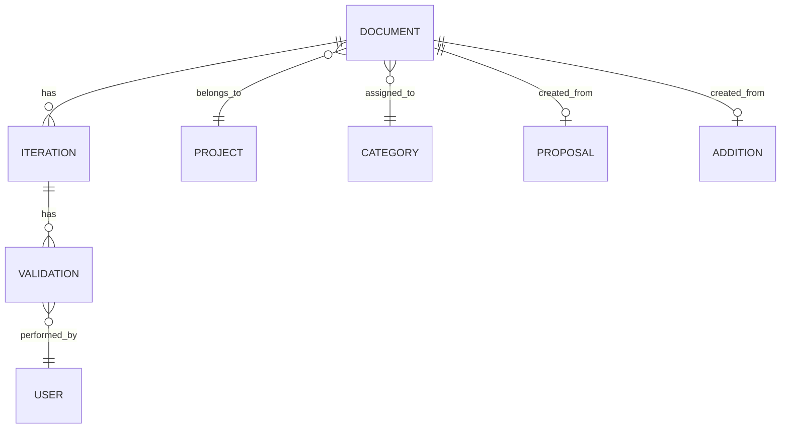
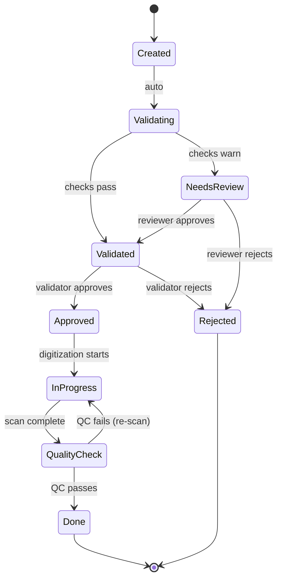

# Documents — Diagrams

## Entity Relationships

```mermaid
erDiagram
    DOCUMENT ||--o{ ITERATION : has
    DOCUMENT }o--|| PROJECT : belongs_to
    DOCUMENT }o--|| CATEGORY : assigned_to
    DOCUMENT ||--o| PROPOSAL : created_from
    DOCUMENT ||--o| ADDITION : created_from
    ITERATION ||--o{ VALIDATION : has
    VALIDATION }o--|| USER : performed_by
```

## Lifecycle State Machine

```mermaid
stateDiagram-v2
    [*] --> Created
    Created --> Validating : auto
    Validating --> Validated : checks pass
    Validating --> NeedsReview : checks warn
    NeedsReview --> Validated : reviewer approves
    NeedsReview --> Rejected : reviewer rejects
    Validated --> Approved : validator approves
    Validated --> Rejected : validator rejects
    Approved --> InProgress : digitization starts
    InProgress --> QualityCheck : scan complete
    QualityCheck --> Done : QC passes
    QualityCheck --> InProgress : QC fails (re-scan)
    Rejected --> [*]
    Done --> [*]
```
