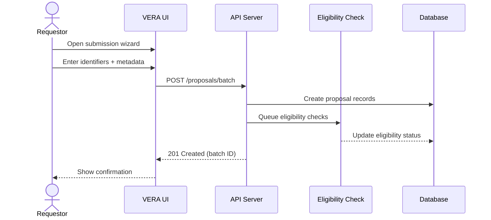
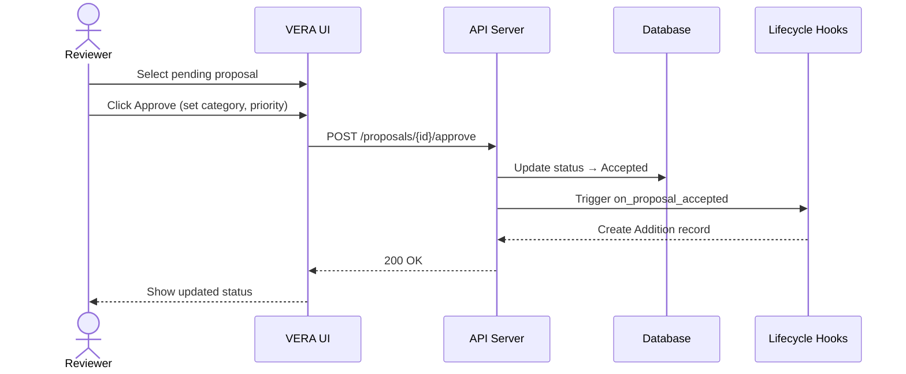
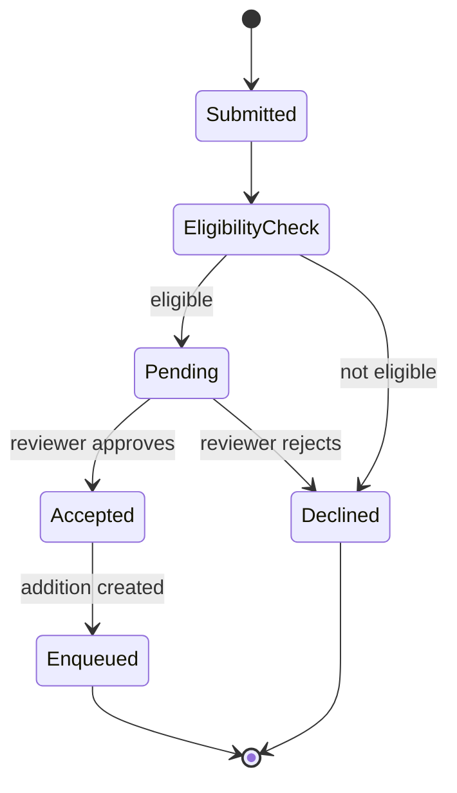

# Proposals — Diagrams

## Submission Flow

```mermaid
sequenceDiagram
    actor R as Requestor
    participant UI as VERA UI
    participant API as API Server
    participant EC as Eligibility Check
    participant DB as Database

    R->>UI: Open submission wizard
    R->>UI: Enter identifiers + metadata
    UI->>API: POST /proposals/batch
    API->>DB: Create proposal records
    API->>EC: Queue eligibility checks
    EC-->>DB: Update eligibility status
    API-->>UI: 201 Created (batch ID)
    UI-->>R: Show confirmation
```

## Review Flow

```mermaid
sequenceDiagram
    actor Rev as Reviewer
    participant UI as VERA UI
    participant API as API Server
    participant DB as Database
    participant Hook as Lifecycle Hooks

    Rev->>UI: Select pending proposal
    Rev->>UI: Click Approve (set category, priority)
    UI->>API: POST /proposals/{id}/approve
    API->>DB: Update status → Accepted
    API->>Hook: Trigger on_proposal_accepted
    Hook-->>API: Create Addition record
    API-->>UI: 200 OK
    UI-->>Rev: Show updated status
```

## State Machine

```mermaid
stateDiagram-v2
    [*] --> Submitted
    Submitted --> EligibilityCheck
    EligibilityCheck --> Pending : eligible
    EligibilityCheck --> Declined : not eligible
    Pending --> Accepted : reviewer approves
    Pending --> Declined : reviewer rejects
    Accepted --> Enqueued : addition created
    Enqueued --> [*]
    Declined --> [*]
```
