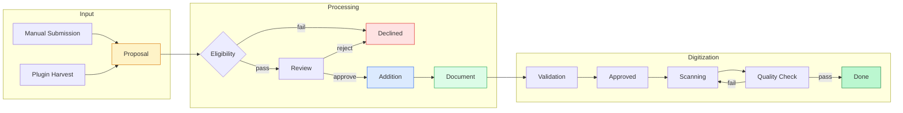

# Pipeline Overview

End-to-end flow from proposal to published digitization.

```mermaid
flowchart LR
    subgraph Input
        A[Manual Submission] --> P[Proposal]
        B[Plugin Harvest] --> P
    end

    subgraph Processing
        P --> EC{Eligibility}
        EC -->|pass| RV[Review]
        EC -->|fail| DE[Declined]
        RV -->|approve| AD[Addition]
        RV -->|reject| DE
        AD --> DO[Document]
    end

    subgraph Digitization
        DO --> VA[Validation]
        VA --> AP[Approved]
        AP --> DG[Scanning]
        DG --> QC[Quality Check]
        QC -->|pass| DN[Done]
        QC -->|fail| DG
    end

    style P fill:#fef3c7,stroke:#d97706
    style AD fill:#dbeafe,stroke:#2563eb
    style DO fill:#dcfce7,stroke:#16a34a
    style DN fill:#bbf7d0,stroke:#15803d
    style DE fill:#fee2e2,stroke:#dc2626
```
